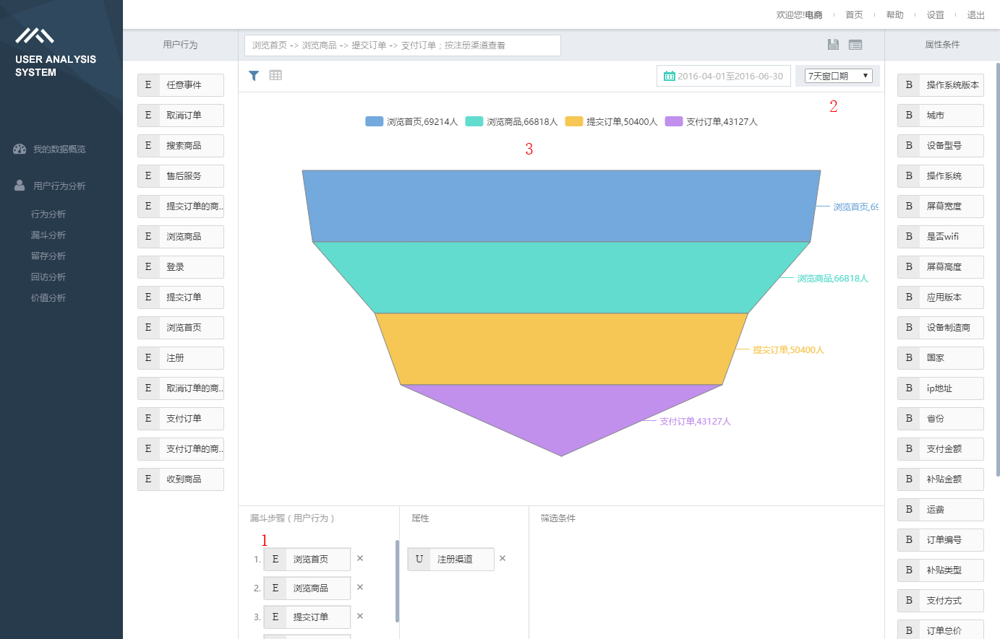

# 漏斗分析

###什么是漏斗分析？

漏斗模型帮助你分析一个多步骤的业务过程中，不同步骤直接的用户转化与流失情况。

以B TO C电商的业务模型举例，

完整的业务过程，包含以下步骤：
1. 浏览商品
2. 将商品添加进购物车
3. 结算购物车中的商品
4. 选择送货地址、支付方式
5. 点击付款
6. 完成付款

想通过数据解读业务执行情况，需要把每个步骤拖到分析区域【1】，选择一个【2】漏斗窗口期，作为转化时间的限定条件。

漏斗窗口期：用户完成漏斗的时间限制，也即只有在这个时间范围内，用户从第一个步骤，行进到最后一个步骤，才能被视为一次成功的转化。

